# Group Capture The Flag Write Up

## What You'll Need

+ 7zip
+ Wireshark
+ Text Editor
+ Autopsy (Digital Forensics Software)
+ Linux Virtual Machine
+ Hex Editor


## Gaining Access to the Files

In this Capture the Flag competition you are given a file called `InstallMe.msi`. However, even though the file is a Microsoft Windows Installer file, you cannot run it in Windows. Instead we can extract it using 7zip. This will result in an executable file called `DFEND_2020.exe`, which we must extract using 7zip again to gain access to the files for the competition. The files will look like this:

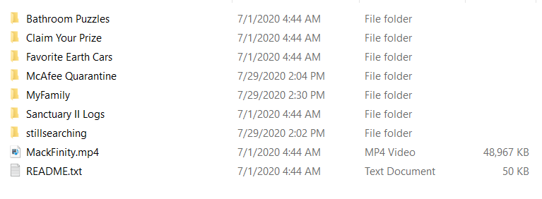

There are a total of 7 folders, 1 MP4 file named `MackFinity.mp4` and 1 text file named `README.txt`. Opening the `README.txt` file in a text editor displays the following message:

```
Welcome to the 2020 DFEND Mackfinity challenge.

If you're reading this, congratulations on passing the first test. Now the challenge can begin.

6 mackfinity stone pieces are hidden on this disk image, numbered 1-6. Each stone contains a section of a GPG private key that you will need to access the file and claim your prize. Read carefully, be attentive to details, and use whatever tools you need to solve the challenge. 

Focus on what matters. Ignore the noise. Find the key.

Work together as you wish, but teams will share the prize equally. No cheating. Thanos is watching.


Good luck.
```

These instructions state that we must find 6 stones hidden on the disk image, with each stone containing part of a GPG private key which we can use to claim the prize. My group found 3 of the stones, and the method we used to find them is found below. 


## Stone 1

The folder `Favorite Earth Cars` contains a large number of images of different cars. By scrolling through these images using File Explorer on Windows, it's evident that one image is unlike the rest in that it has no thumbnail:

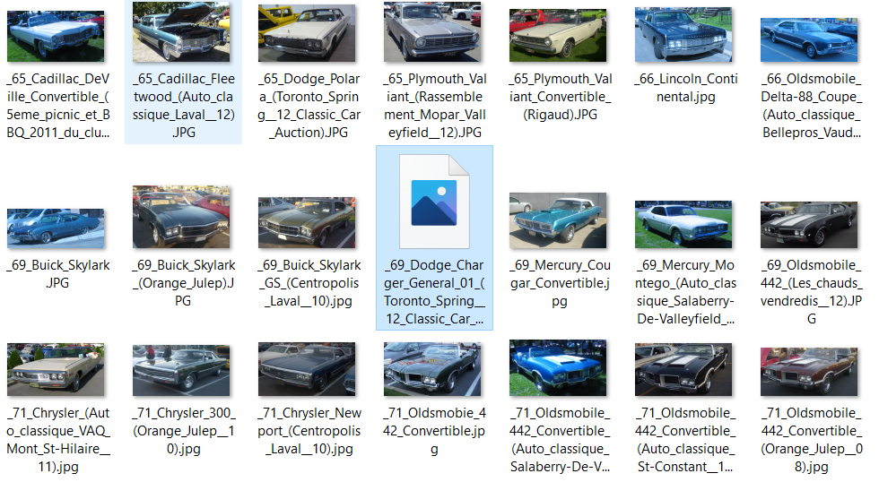

Trying to open the image in Windows Photos fails, and it says that Windows doesn't support this file format. If we open this file in a hex editor, we can see that a message was placed in beginning bytes of the file:

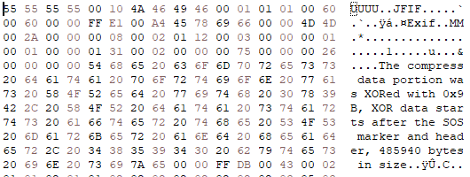

The message states:

```
The compress data portion was XORed with 0x9B, XOR data starts after the SOS marker and header, 485940 bytes in size
```

This tells us to perform an XOR bitwise operation on the compressed data portion of the JPG file with the key `9B` in hexadecimal. Now, we must find the compressed data portion in this file, which starts after the SOS marker and header. SOS stands for `Start of Scan` and is a byte marker for the beginning of the compressed data in a JPG. In hex, it's represented by the bytes `FF DA`. By searching for these bytes in this image file in our hex editor, we can find where the compressed data portion begins. Using the search function in the hex editor, `FF DA` was found at offset 775 in decimal. The next two bytes represet the length of the SOS header. In this case, the next two bytes are `00 0C` which is equivalent to 12 in decimal. This signifies that the header is contained in the next 12 bytes. Below is the SOS marker and header:

```
FF DA 00 0C 03 01 00 02 11 03 11 00 3F 00 1C 6D
```

After the header ends, the compressed data portion begins, which is what we're after. In our hex editor, select the block beginning from the byte after the header and going 485,940 bytes long, as stated in the beginning of this file. Now copy and paste this hex chunk into the `Input` section of CyberChef, and apply the `From Hex` operation and the `XOR` operation with the key `9B` in hexadecimal:

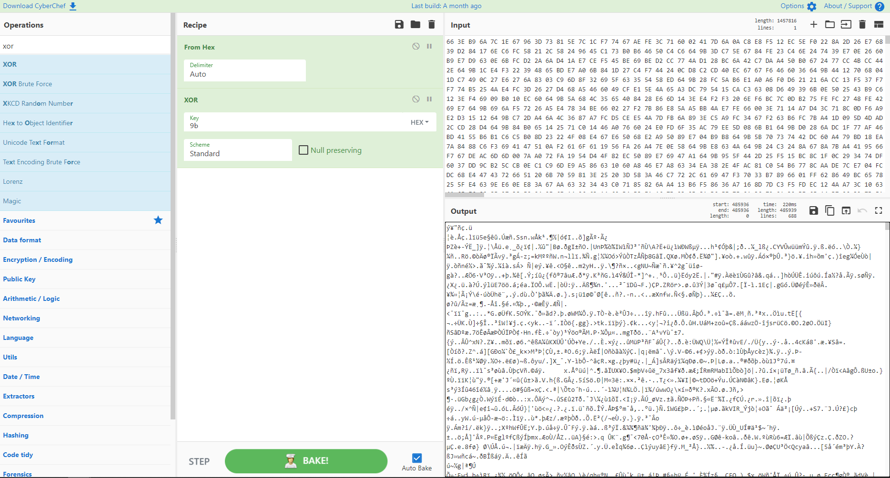

If we use `Ctrl+F` to search for `stone` within the decoded text, we see that we have found stone 1:

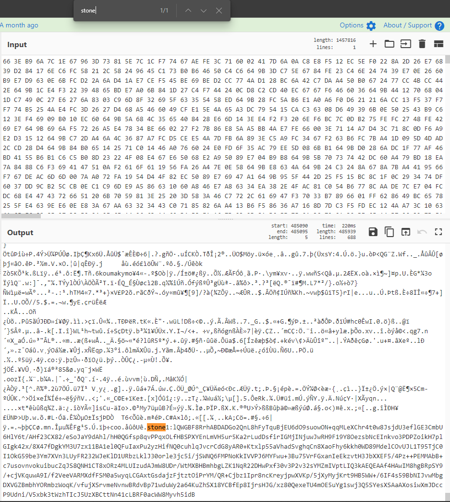


```
stone1:lQWGBF8RrhABDADGo2QnL8hFyTquBjEU6dO9suowON+qqMLeXChr4t0w8JsjdU3eflGE3CmbU6HlY6t/AHf23CX82/eSoJaY9dAhl/hH0QGfsp8qvPPqxOLfHBSPXYEnLmVH5ur5Ka2rLudDsfirIGMjINjuwJwRH9F19Y8OezsbNcEInkvo3PDPZoikH7plGIgk42x/8X47fDgkYM3U7zx11BA1el0QFuIaxPu2yzHifNQ0cuhlqJvcrCdG8yAR0+Ktxlp55aVhadSvghqCn8XaoFhy6kkh0WD89MdelCOvUJL1T95TjC0I1OkG59be3Ym7XVn3LUyFR232WJeKlD1URbzLklJ30orle3jc5i/jSWNQ6FMPNoKkIVVPJ6MYFwu+3Bu75VrFGxanIeEkzvtH3JbXXEF5/4Pz++PEMMAbB+c7usovnvokuibucZqJS8QNH1CT8xORz4MLUIzudAJmW8UDr/WtMXBHBmhbgLZK1NqR22DHwPxf30v3P2v32sYMZmIVptLIQ3kAEQEAAf4HAwIM8hgBRpSY9/+cjVKquwA9I/f2VeeVARMXdfFSM0a5wyqLCGAxtGsdajzFjtztOiPrYM/QR+Cjbz1Ipr8ncKreyjpwXVKp/5jXyMyjKrt9HB5WW+/6IF4s59BbNIJvwMbgDXVGZBmbhYORmbzWoqK/vfujXSrvmeNvnwBRdvBp71wduWy2a64KuZhSX18YCBfEp8IjrsHJG/xz80QexeTU4mOE5uYg1swj3Q5SYesXSAaAXosiwXmJDccP9Udni/V5xbk3tWzhTIcJ5UzXBCttNn41cLBRF0acWW8Myvh5idB
```

## Stone 2

Inside the `Sanctuary II Logs` folder, there is a file named `network_capture.pcapng.gz`. Pcap files typically contain packet data from a network and can be analyzed using Wireshark. If we open this file in Wireshark we can see a bunch packets with lots of information:

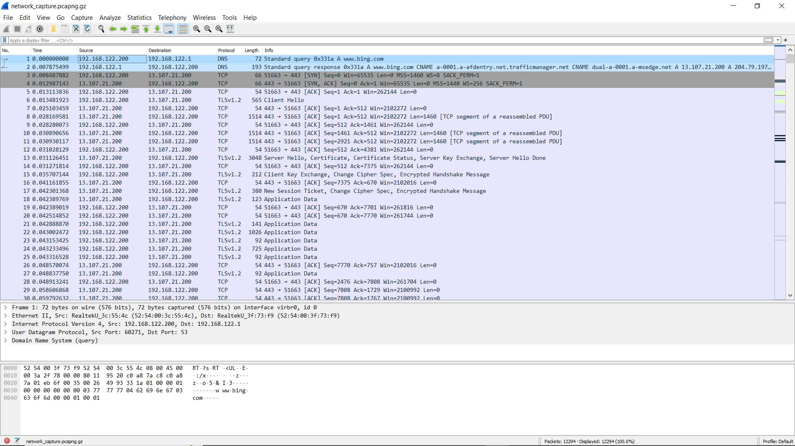

An efficient way to analyze pcap files in Wireshark is by following TCP Streams. Doing this allows you to follow a particular TCP conversation between two or more hosts. To follow a TCP Stream select the `Analyze` button at the top of the screen, then select `Follow` and finally `TCP Stream`. This will open a window that looks like the following:

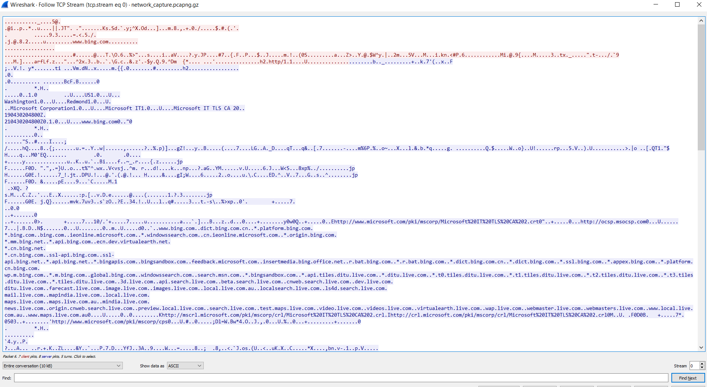

We can click through these TCP Streams to see if we find anything interesting. If we look at TCP Stream number 112, we can see that it is an ELF file:

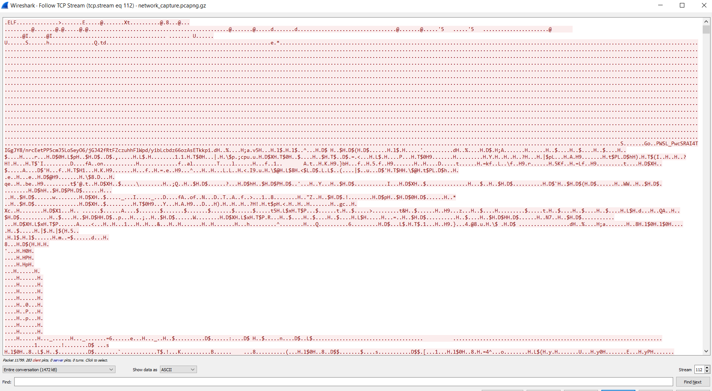

ELF stands for 'Executable and Linkable Format' and is a common file format for storing executable files. Let's try and run this file. ELF files are easily run in Linux via the command line. However, before we run it, we must extract the file from the TCP Stream in Wireshark. To do this, we must show the data as `Raw` and copy-paste it into a new file. To show the data as raw, click on the down arrow next to `ASCII` near the bottom of the screen, then select `Raw`. Now highlight all the text and copy and paste it into a new file. We can now change the data from raw hex into ASCII using CyberChef. Insert the file into CyberChef and apply the `From Hex` operation to the file. The output should appear like the following:

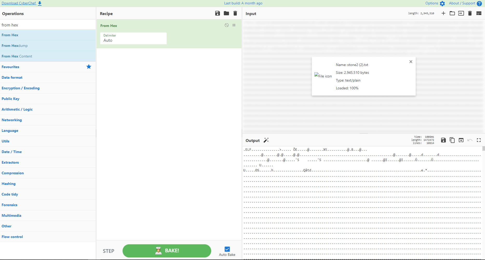

Now, we can save this ELF file and run it in Linux. In my example, I'm using a Kali Linux VM to run the file. Before running the file, we have to give it permission to execute. To do this, run the following command with your filename and extension:

`chmod +x filename.extension`

Now we can run the file with this command:

`./filename.extension`

The output should look like this:

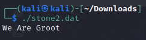

That isn't the stone, but if we run the command `ls` we can see that running the elf file created a new text file named `stone2.txt`. We can view the contents of this text file using the `cat` command:

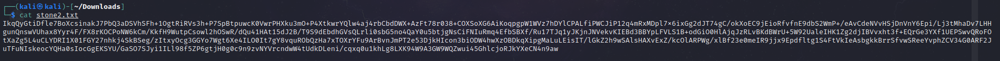

Stone 2:

```
IkqQyGtiDfle7BoXcsinakJ7PbQ3aDSVhSFh+1OgtRiRVs3h+P7SpBtpuwcK0VwrPHXku3mO+P4XtkwrYQlw4aj4rbCbdDWX+AzFt78r038+COXSoXG6AiKoqpgpW1WVz7hDYlCPALfiPWCJiP12q4mRxMDpl7x6ixGg2dJT74gC/okXoEC9jEioRfvfnE9dbS2WmP+/eAvCdeNVvHSjDnVnY6Epi/Lj3tMhaDv7LHHgunQnswVUhax8Yyr4F/FX8rKOCPoNW6kCm/KkfH9WutpCsowl2hOSwR/dQu41HAt15dJ2B/T9S9dEbdhGVsQLrli0sbG5no4QaY0u5btjgNsCiFNIuRmq4EfbSBXf/Ru17TJq1yJKjnJNVekvKIEBd3BBYpLFVLS1B+odGiO0HlAjqJzRLvBKdBWrU+5W92UaleIHK1Zg2djIBVvxht3f+EQrGe3YXf1UEPSwvQRoFOtXaZg5L4uCLYDRI1X01FGY27nhkj4SkBSeg/zItxyOcg3GGYo7Wgt6Xe4ILO0It7gY8vquRObQzHa7xTOXrYFu9ArBvnJmPT2e53DjkHIcon3biODW4hwXzOBDkqXipgMaLuLEisIT/lGkZ2h9wSAlsHAXvExZ/kcOlARPWg/xlBf23e0meIR9jjx9Epdfltg1S4FtVkIeAsbgkkBrrSfvwSReeYvphZCV34G0ARF2JuTFuNIskeocYQHa0sIocGgEKSYU/GaSO7SJyi1ILl98f5ZP6gtjH0g0c9n9zvNYVrcndwW4tUdkDLeni/cqxq0u1khLg8LXK94W9A3GW9WQZwui45GhlcjoRJkYXeCN4n9aw
```

## Stone 5

For stone 5, I used Autopsy. Autopsy is digital forensics tool which can be used to view our disk image and find deleted files that don't appear in the normal filesystem. After opening our disk image in Autopsy, you should see the following:

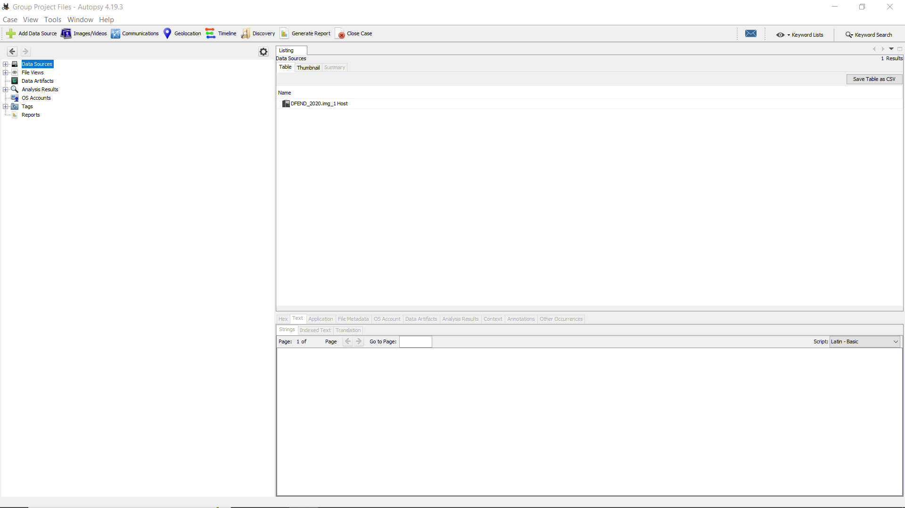

By clicking through the options on the left, we can view the files in the disk images by different categories, which is helpful for finding files that may be hiding in folders with files of a different type. The following sections will lead to a file which contains stone 5:

```
File Views -> File Types -> By MIME Type -> application -> x-sharedlib
```

After successfully selecting those categories, you should be presented with the following files:


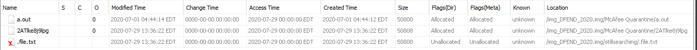

If we click on any file, we can see the file text in the window in the bottom left of the screen. Click on the file named `2ATlke8j9lpg`. If we look at the text that appears in the lower window, we can see stone 5:

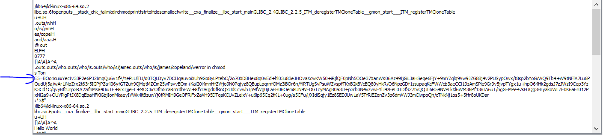

Stone 5:

```
s Ton E5=BOo1suixYecIv33P2e6PJ2ImqQu6v1fP/YePLUlTU/o0TQLDyv7DCIIqauvoiXUh9Go8yLPtebC/2o70XDBH ex8q0vEd+hl03u83eJHOvaXcwKW50+iRjlQF0pNh5OOe37XanWK06Az49IjGiLJaHSeqe6FjY+9mYZqlq9Vw9JZG8Bj4v2 PUSypOwx/t8sp2bYoGAVQ9Tb4+W9tNFlA7Lu6POudUj5a/wAr1iNpZrx2t63r5IGPjPZa406yfGTZuh9QMqtMZCm25wPsv vEOm+Kal20i4mnHfZVfjo9N0Pqjyz8QBupLpqrnfOMz3lBOr6n/YiRTUgSvPsuWZvspfTKxB2kBVcEQ80yHkR/O6NpzGDf 1zsupaqKcFWWcb3aeCCl19zAmSPie9Gr9v5jvpTYgx1u+hpO64Hk2gdsJ7zJWzI9Cep3YzK3Cd1C/qvyBfcUrp3RA2zifn Ms84UiuTF+8ixTjjeEL+MOCIicOfm5YaRnYdbEWi+8fYDRgd0fRnQxUdCcvwhTp9fWg0jLaEH0BOem8UN9VFDGTcyMAgB0 a3U+p3rb3N4vzvwFYlJ4zFeL0TDfS27tvQQJL6R54NVPLkXl6WM36Pf13BIA6uT/ngGEMPe47sHJQg3HryakoWLZE0K6aE r012PxNl2a9+OUVPigPtJX8DqEbaHFKiGbjIonMkaeyIVWk4itBzuwYj0fRMIH9GeOFRiFxZaVH95DTqaKCUvZLelxV+u6 ip65Cq2fK1+0ug/a5CFu/l/XIdiSqjy1Ez8SEDJUw1aV5TfRlEZonZv3p6dmVWJ3mCiwpoQh/cTNkNj1os5+5ffr8oUKDar
```

Note: This file containing stone 5 is in the `McAfee Quarantine` folder and can be found without Autopsy, however using Autopsy makes it far easier to find the file. Without Autopsy, you would have to click through the many files of unknown format in the `McAfee Quarantine` folder to identify the one with a stone. 


