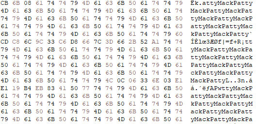
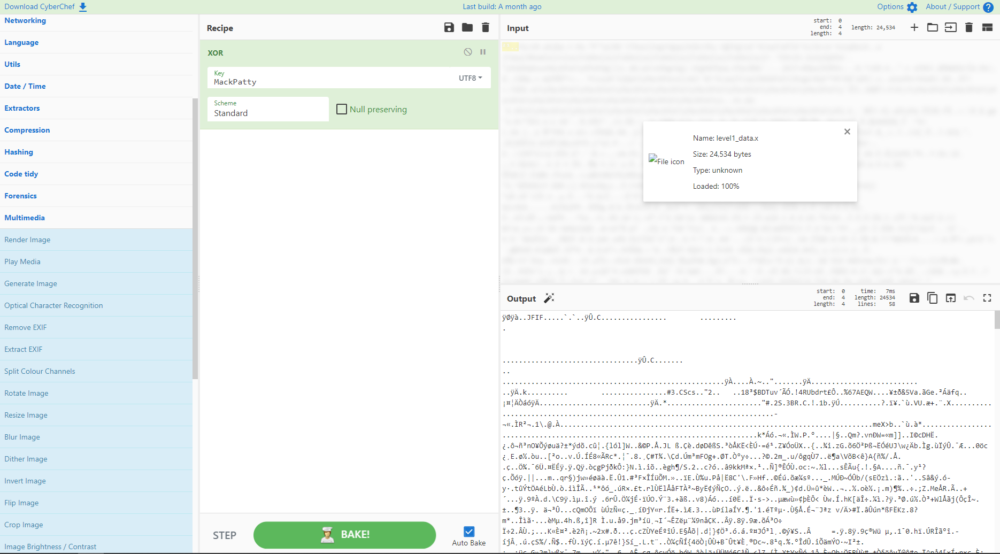
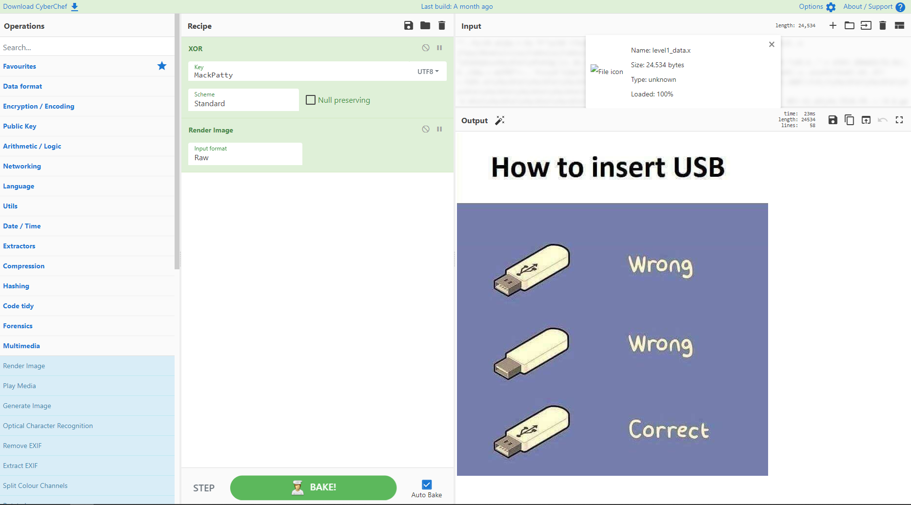
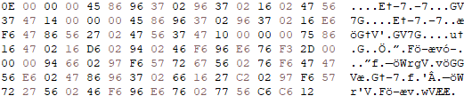
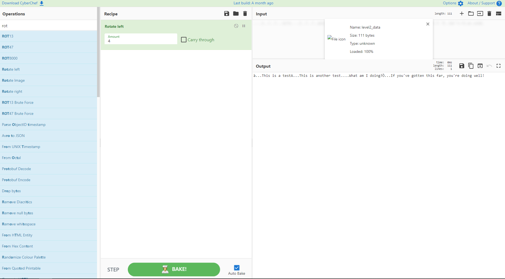
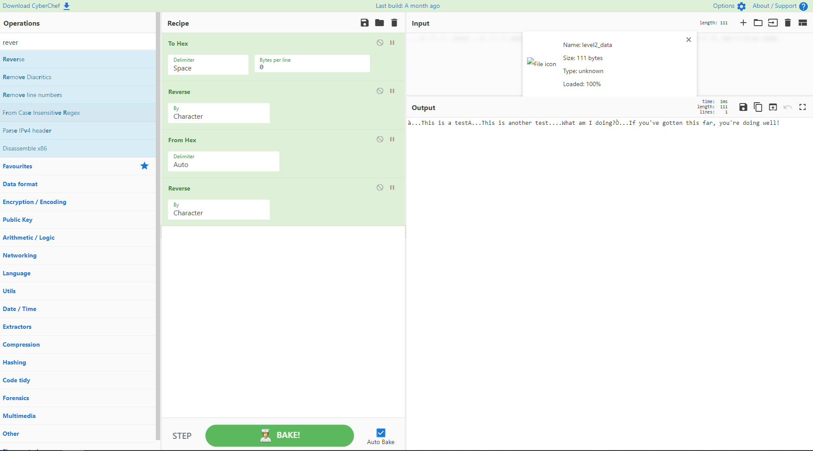
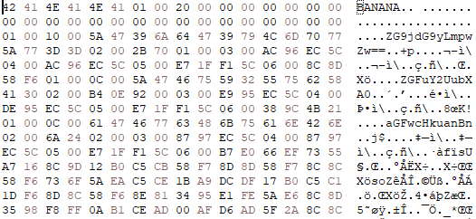
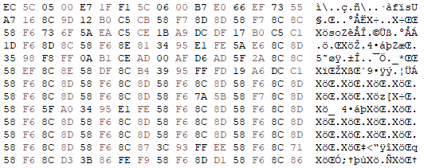
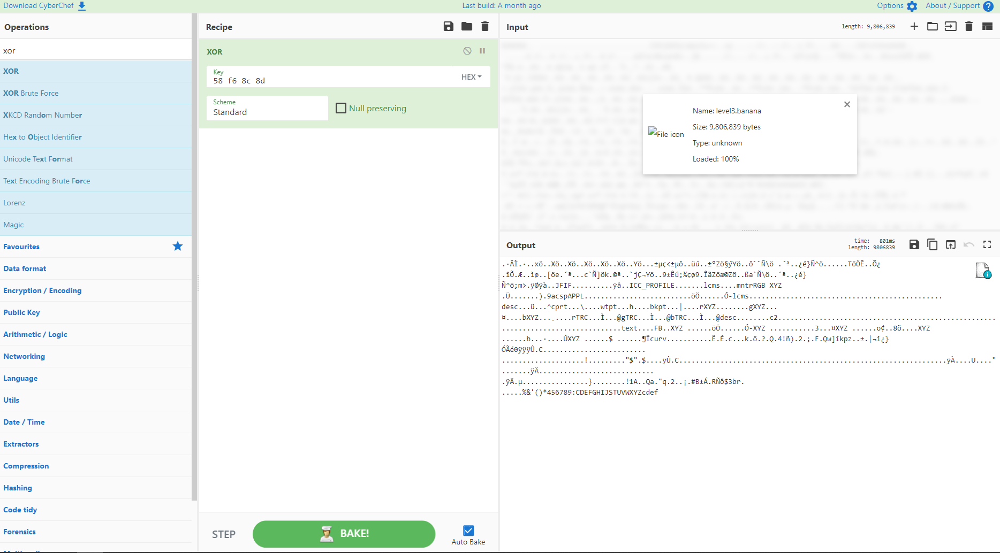
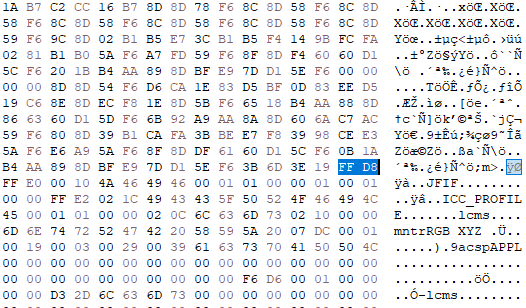

# File Format Reverse Engineering Write Up

This project contains four levels, however this write up will only cover the first three as I have yet to attempt the final level. In the first three levels, you are given a file of unknown format, and have to use pattern analysis to gather data from the file. 

## What You'll Need

+ Hex editor of choice
+ Python environment (version 2 or 3)

## Level 1

In level 1, you're given a file called `level1_data.x`. The file is 24 kilobytes. By opening the file in a hex editor, I quickly noticed that the phrase `MackPatty` in ASCII repeated frequently:



 In files that have had the XOR operation applied, the key that the file was XORed with typically repeats, as any bytes that are equal to zero will become the key based on the nature of the XOR operation. Based on this, it's likely that the file has had the XOR operation applied with a key of `MackPatty`. To decrypt this file, it simply must have the XOR operation applied again with the same key, as to undo an XOR you apply the XOR operation again. This can be done using the website [CyberChef](https://gchq.github.io/CyberChef/). Insert the file into CyberChef and drag the XOR operation into the `Recipe` section. Insert `Mack Patty` as the key and which the encoding the UTF8 instead of hex. Then press `Bake!` to decrypt the file. As seen in the image below, the output now shows the text of a JPG file. 
 
 
 
 This can be determined by the ASCII characters seen in the beginning of the file `ÿØÿà`, which correlate to `FF D8 FF E0` in hex. These represent the magic bytes of a JPG file. Magic bytes, otherwise known as file signatures, are data used to identify the content of a file. Every JPG starts with the same magic bytes, therefore the output file must be a JPG. To view the image, drag the `Render Image` operation into the recipe and press `Bake!`. The following image should appear:

 

### Level 1 Bonus

Now that we've decrypted the file from Level 1, we can write a Python script to encrypt and decrypt data using the XOR bitwise operation. The Python script I wrote can be viewed [here](level1/xor.py). The script accepts up to 3 arguments: i, o, and k. The `-i` argument accepts the encrypted file path, the `-o` argument accepts the name of the output file, and the `-k` argument accepts the key for the XOR operation. The script then opens the encrypted file as a byte array, and applies the XOR bitwise operation to every byte in the file using the previously inputted key. 

## Level 2

In level 2, you're given a file called `level2_data` with no file extension. The file is only 111 bytes. By opening the file in a hex editor, we can see the following:



When I was attempting to decrypt this for the first time, I didn't notice any patterns or repeating phrases, so I tried using different operations in CyberChef. Eventually, by rotating the bits left by four, the output changed to plaintext and the file was decrypted:



However, this is not the intended method of decrypting this file. By looking at the file in a hex editor, you may notice that many of the hex values translate to common ASCII characters found in plain text when reversed. For example, the value `02` in hex is repeated frequently in the file, and the hex value `20` corresponds to a space in ASCII. Therefore, by reversing the hex in the file, we can decrypt it into the plain text message:



### Level 2 Bonus

Now we can write a Python script to rotate bytes or reverse hex. I chose to rotate bits because that was the method I originally used to decrypt the file. The Python script I wrote to do this can be found [here](level2/level2_decrypt.py). This script contains a function that rotates a given byte to the left according to the given amount. The method used to rotate the bits isn't the most efficient, however it was based on the logic that made the most sense to me while learning how to rotate bits. 

## Level 3

In level 3, you're given a file called `level3.banana`. The file is 9,577 kilobytes. By opening the file in a hex editor, we can see the following:



In base64, equal signs are added to the end of encoded strings for padding if necessary. In the ASCII portion of the hex editor, we can see a string with two equal signs on the end, making it likely to be base64 encoded. By decoding the base64 string into ASCII using the [CyberChef](https://gchq.github.io/CyberChef/) `From Base64` operation, we can see that it is a filename:


There are two strings in the following bytes of the file that appear to look similar to the first base64 string, even though they don't include equal signs for padding. By decoding these strings from base64 into ASCII via the same method, it's seen that these strings are also filenames:

| Base64  | ASCII     |
| ------- | --------- |  
| ZG9jdG9yLmpwZw== | doctor.jpg |
| ZGFuY2UubXA0 | dance.mp4 |
| aGFwcHkuanBn | happy.jpg |

Based on the large size of the file, it's likely that these three files are contained within the single `level3.banana` file. 

By looking at the hex further, some other patterns begin to emerge. Before every base64 string, there are four bytes that follow a consistent pattern. 

| Base64 String  | Four Previous Bytes     |
| ------- | --------- |  
| ZG9jdG9yLmpwZw== | `01 00 10 00` |
| ZGFuY2UubXA0 | `01 00 0C 00` |
| aGFwcHkuanBn | `01 00 0C 00` |

If we take the last two bytes from each row in the above table and translate them to ASCII, it results in the numbers `16`, `13`, and `13`. This represents the number of bytes in each base64 encoded string. The two bytes `01 00` are most likely some sort of identifier, telling a program that the following two bytes represent the length of the base64 string.  

The bytes in between each base64 string are also arranged in a pattern. The bytes after each base64 string are seen below, excluding the bytes in the table above.

```
02 00 2B 70 01 00 03 00 AC 96 EC 5C 04 00 AC 96 EC 5C 05 00 E7 1F F1 5C 06 00 8C 8D 58 F6 

02 00 B4 0E 92 00 03 00 E9 95 EC 5C 04 00 DE 95 EC 5C 05 00 E7 1F F1 5C 06 00 38 9C 4B 21 

02 00 6A 24 02 00 03 00 87 97 EC 5C 04 00 87 97 EC 5C 05 00 E7 1F F1 5C 06 00 B7 E0 66 EF
```

In each of these hex strings, we can see the repetition of `02 00`, `03 00`, `04 00`, `05 00`, and `06 00`. These are most likely also identifiers for a program, identifying that the information after it means something, just like with `01 00` preceding the two bytes representing the length of each encoded filename. 

After an identifier, there are always four bytes before the next identifier. By looking at the four bytes following each identifier, we can determine their purpose. 

Based on our previous conclusion that the three filenames encoded in base64 have the content of their files within this file, one of the four byte chunks likely represents the location of the file contents.

By hightlighting the four bytes following the `02 00` identifier in the first hex string in a hex editor, we notice that they are equivalent to the number 94,251 in decimal. We can repeat this for the bytes in the other hex strings, giving us the table below.

| File Name  | Four Bytes Following 2nd Identifier | Decimal Value
| ------- | --------- |  ------
| doctor.jpg | `2B 70 01 00` | 94,251
| dance.mp4 | `B4 0E 92 00` | 9,572,020
| happy.jpg | `6A 24 02 00` | 140,394


The size of an mp4 file is much larger than the size of a jpg file, and this is reflected in the decimal values of the byte chunks. Therefore, it's likley that these bytes represent the length in bytes of the three files respectively. 

The four byte chunks following the next three identifiers all look similar, so it's likely they represent something similar. When highlighting them in a hex editor, they are equivalent to recent dates and times using unix timestamp conversion. Therefore, these bytes likely represent the created, accessed, and modified dates of each respective file commonly stored in file metadata. 

That leaves the 6th identifier, which has seemingly random chunks of four bytes following it. However, by looking slightly below the end of the hex string following the last base64 encoded filename, a pattern of repeating hex strings emerges:



The bytes `58 F6 8C 8D` are frequently repeated, pointing towards the idea that this section of the file underwent an XOR bitwise operation. Using CyberChef, I undid the XOR using the key `58 F6 8C 8D`, similarly to level 1. The output is as follows:



As you can see in the output, there are the unmistakable magic bytes of a JPG file, similar to level 1. By saving this XORed file and opening it in a hex editor, we can cut all of the bytes preceding the JPG magic bytes. However, we still need to find the end of the JPG file. Just like there are markers for the beginning of files, there are also markers for the end. The bytes `FF D9` represent the end of a JPG, and by cutting of the rest of the file after those bytes, there is now a clean JPG file which can be viewed by the operating system: 


The bytes following the 6th identifer are `8C 8D 58 F6`, which is the key used to perform the XOR operation on the file to decode the doctor.jpg image, except out of order. By looking at the XORed `level3.banana` file before cutting off the portion above the JPG, we can see that the JPG starts off with two bytes on a line rather than starting a new line entirely:



This accounts for the offset in the XOR key, meaning that the 6th identifier is the XOR key itself. Additionally, the image file has a size of 94,251 bytes, which corresponds to the four bytes after the 2nd identifier as previously stated. 

Based on the positioning of the file, it's likely that a script is meant to disect this file into three seperate ones and XOR each separately, by parsing the bytes in the beginning of the file. However, I did not have enough time to write the script, so I found the `dance.mp4` and `happy.jpg` files by hand.

Restarting with the original file, I found the byte where the JPG file ended, and copied 9,572,020 bytes (file size from the 2nd identifier) down and put those bytes in a new file. Looking at the file in a hex editor, it's evident that a XOR operation was also performed:


The repeating bytes line up with the bytes following the 6th identifier, and by using the XOR operation in cyberchef on this file I was able to decode it into a MP4 file:


The MP4 file can be viewed [here](level3/Solution%20Images/dance/decrypteddance.mp4).

Restarting with the original file once again, I found the byte where the MP4 file ended and copied the next 140,394 bytes (file size from the 2nd identifier, and to the end of the file) and put them in a new file. Just like the other two files, it's evident a XOR was performed:


The repeating bytes line up with the bytes following the 6th identifier, and by using the XOR operation in cyberchef on this file I was able to decode it into a JPG file:


