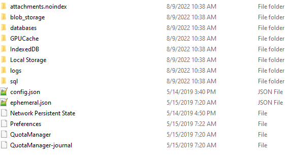

# Signal Parser Write Up

In this project, you're given a zip file called 'Signal_Data.zip'. We can extract it to see the Signal Private Messenger artifacts, and are tasked with writing scripts to decrypt the database with the messages and parse it into an easily readable format.

## What You'll Need

+ Hex editor of choice
+ Raw text editor of choice
+ Signal_Data.zip file
+ Python environment (version 2 or 3)
+ DB Browser (SQLCipher)
+ 7zip
+ Ubuntu VM 

## Level 1

In level 1, we are tasked with examining the files in 'Signal_Data.zip' to determine what they are, using a combination of hex and text editors. 

After extracting the file using 7zip, we can view its contents: 


The '_MAXOSX' folder contains 3 folders and 1 file:


The folders contain various files with all of the same content when viewed in a hex editor:


This presumably means that the user wasn't on MacOS, therefore there isn't likely to be anything meaningful in the '_MACOSX' folder. 

The 'Signal' file contains 8 folders and 6 files: 



+ The folders 'Local Storage' and 'IndexedDB' contain the manifest and log files to keep track of versions and updates. 

+ The 'logs' folder contains logs listing what the application did, including API calls. 

+ The 'GPUCache' folder presumably stores the GPU caches, but in this instance contains 5 files of varying lengths with mostly bytes of 00. 

+ The 'databases' folder contains one SQLite database file with three primarily empty tables and one entirely empty database journal file. 

+ The 'blob_storage' folder contains another folder containing nothing.  The 'attachments.noindex' folder contains the attachments (images, videos, audio files) sent in the users conversations. 

+ The 'sql' folder contains an SQLite database called 'db.sqlite'. This database is presumably encrypted as when viewed in a hex editor, the ASCII values are random and the SQLite magic bytes aren't present as in the other SQLite database files. 

+ The 'config.json' file contains a string labeled as 'key'. 

+ The 'Network Persistent State' file contains data to maintain the persistent HTTP connection. 

+ The 'Preferences' file contains data regarding the users preferences, including the last open directory. 

+ The 'QuotaManager' file is a SQLite database that contains three practically empty tables. 

+ The 'QuotaManager-journal' file is empty.

## Level 2

Now that each file's purpose is relatively understood, the next step is to identify the main Signal Database and decrypt it using Python.

As previously determined, the only encrypted database was the 'db.sqlite' file in the 'sql' folder. This file is most likley an SQLites database, based on the file extension. There are a few different methods of encrypting an SQLite database, with the most popular method being SQLCipher. SQLCipher is an extension to SQLite that allows for AES encryption on SQLite databases. 

To check if the database is encrypted using SQLCipher, we can use a tool called DB Browser (SQLCipher). Open the tool and select 'Open Database'. We're now prompted to enter a password to decrypt the database. We can try using the string from the 'config.json' file labeled 'key'. Switch the option to 'Raw Key' instead of passphrase, enter '0x' as prompted and paste in the key from the 'config.json' file. Switch the encryption settings to SQLCipher3 defaults and press OK. 


Now we can view the database file, and now we know that the database is encrypted using SQLCipher 3. 

To decrypt the database in Python, we need an SQLCipher 3 package. In this case, we will use a package called 'sqlcipher3' which can be downloaded from this [github repository](https://github.com/coleifer/sqlcipher3). To make the install simpler, install on an Ubuntu Virtual Machine using pip. Pip is a package installer for Python. If it's not already installed on the Ubuntu machine, install it using the following commands:

`$ sudo add-apt-repository universe`

`$ sudo apt-get install python3-pip`

Once pip is installed, install sqlcipher3 using the following command:

`$ pip install sqlcipher3-binary`

Now that we have an SQLCipher3 package in our python environment, we can decrypt the database. First, connect to the database by running the 
following code in a python shell:

```python
from sqlcipher3 import dbapi2 as sqlcipher
db = sqlcipher.connect('directoryofsqlitedatabasehere')
```

Then decrypt the database by passing the key from 'config.json' into the execute function:

```python
db.execute('PRAGMA key = "x\'f0fdad64e7e0a677dc69e24874762cea6a742a74761e359ea01a6cd1f40f0bff\'"')
```

Note: before parsing the database, the following function must be run in order to ensure that SQLCipher3 encryption is used and not SQLCipher 4:

```python
db.execute('pragma cipher_compatibility = 3')
```

Now we can print data directly from the database. The line below prints all the tables in the database.

```python
for table in db.execute('SELECT name FROM sqlite_master WHERE type="table" ORDER BY name ASC;').fetchall():
```

## Level 3

Now that we've decrypted the database using Python, let's go back to DB Browser to view the structure of the database so we know what data we need to parse. 

Using the same steps as in level 2, open the database in DB Browser. It should look something like this:


There are 16 tables in the database as follows:

1. Attachment_downloads
2. Conversations
3. identityKeys
4. Items
5. Messages
6. Messages_fts
7. Messages_fts_config
8. Messages_fts_content
9. Messages_fts_data
10. Messages_fts_docsize
11. Messages_fts_idx
12. preKeys
13. Sessions
14. signedPreKeys
15. Sqlite_stat1
16. Unprocessed

The contents of each table can be viewed by selecting 'Browse Data' and selecting the table to view. The two most important tables are the 'Conversations' table and the 'Messages' table. The 'Conversations' table lists the phone numbers with which the user exchanged messages with, including whether they were group or private messages: 


Based on the information from this table, it can be determined that the user most likely texted two individuals privately, texted them within a group, and texted himself. It can also be determined that the phone number of the user is most likely 17039198567 and the phone numbers of the two individuals are 17036516754, and 17036512962. 

The 'Messages' table is a list of all the messages sent and received by the user, including whether they're outgoing or incoming messages, the phone numbers the messages were sent to and from, and when the messages were sent and received: 


Now that we understand the structure of the database, the important database data can be parsed. [Here is a python script](reports/parse-messages-Level%203.py) that prints the tables in the database along with the messages and important information related to each message.

## Level 4

Parsing the data as done above does not allow the messages to be read as if they were in the user's Signal application (in the flow of conversation). [This python script](reports/present-messages-Level%204.py) writes the messages to a text file in the proper flow of conversation with each phone number respectively. 


[Here is the text file output](reports/messages-Level%204.txt) from the above script.

## Bonus

Taking this a step further, the messages can be displayed in HTML files using stylesheets to display the messages as if an analyst was using Signal to view the conversation. [This python file](reports/HTML%20Message%20Files/htmlfiles.py) creates 4 HTML files, one for each conversation the user had, and displays them in a chat messaging format using stylesheets. The HTML file for each conversation can be viewed below:

1. [Conversation 1](reports/HTML%20Message%20Files/convo1.html)
2. [Conversation 2](reports/HTML%20Message%20Files/convo2.html)
3. [Conversation 3](reports/HTML%20Message%20Files/convo3.html)
4. [Conversation 4](reports/HTML%20Message%20Files/convo4.html)


